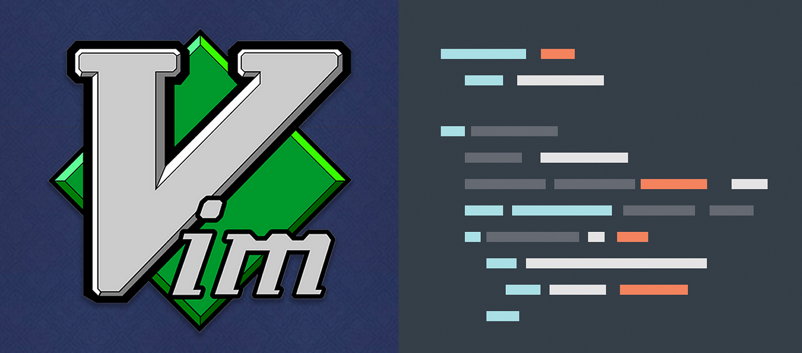

# Basic-Vim-Tutorial

## Introduction

Welcome to my Vim Tutorial! In this series, I’ll be exploring the powerful features of Vim, a highly efficient text editor. Whether you’re a beginner or looking to enhance your skills, this project will help you get the most out of Vim.

## What You Will Learn

- What is Vim?
- Basic Editing
- Navigation
- Advanced Editing
- Working with file
- Customizing Vim

## YouTube Channel

Follow along on my YouTube channel for video tutorials and demonstrations: [Sharky Coding](https://www.youtube.com/@sharky_coding)

## Conclusion

Join me as we dive into the world of Vim! Stay tuned for updates and new videos.
