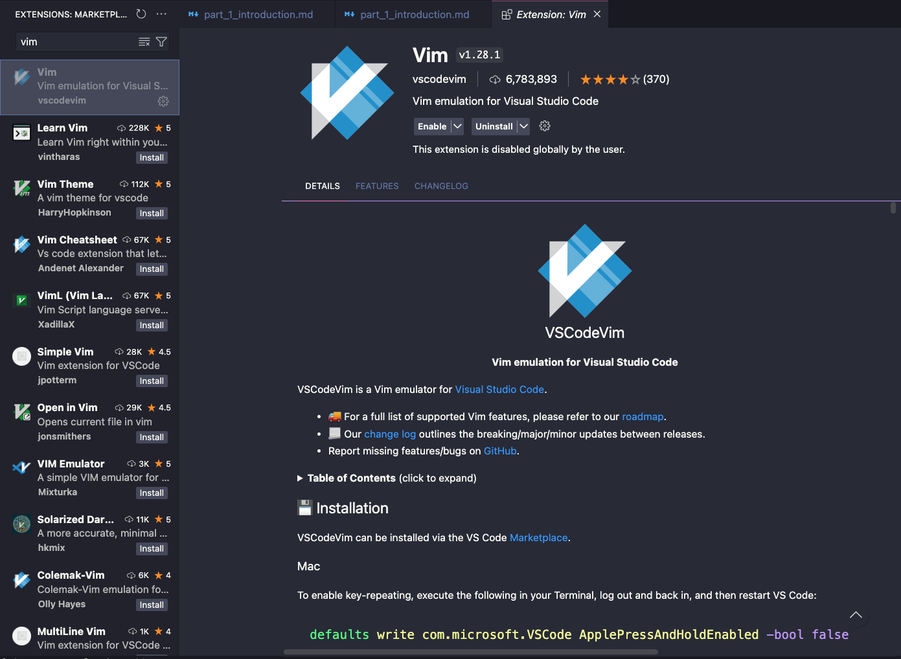

# Introduction to Vim

## 1.1 What is Vim?

Vim is a highly configurable text editor built to make text editing more **efficient**. It is an improved version of the vi editor, which is standard on most UNIX systems. Vim allows for fast navigation and editing of text without the need for a mouse.

## 1.2 How to Install Vim

To install Vim, follow the instructions for your operating system:

### Linux

Most Linux distributions come with Vim pre-installed. If it's not available, install it using the package manager:

```
sudo apt install vim      # Debian/Ubuntu
sudo yum install vim      # CentOS/RedHat
```

### macOS

On macOS, Vim can be installed using Homebrew:

```
brew install vim
```

### Windows

For Windows, download the installer from the official Vim website [here](https://www.vim.org/download.php) or use a package manager like Chocolatey:

```
choco install vim
```

### Virtual vim on Visual Studio Code

Go to Extensions, then search for Vim and install it. Remember to enable the Vim extension



## 1.3 Basic Navigation in Vim

Once installed, you can start Vim by typing `vim` in your terminal. Here are some basic navigation keys in Normal Mode:

- `h` - move left
- `j` - move down
- `k` - move up
- `l` - move right

## 1.4 Vim Modes

Vim has multiple modes for different types of operations:

- **Normal Mode**: For navigation and commands (default mode).
- **Insert Mode**: For text insertion. Press `i` to enter Insert Mode.
- **Visual Mode**: For selecting text. Press `v` tov enter Visual Mode.
- **Command Mode**: For running commands. Press `:` to enter Command Mode.

## 1.5 Saving and Quitting Vim

- To save changes, press `:` to enter Command Mode, then type `w` and press Enter.
- To quit Vim, type `q` and press Enter.
- To save and quit at once, type `:wq`.
- To quit without saving, type `:q!`.

---

Continue to the next part for more editing basics in Vim!
